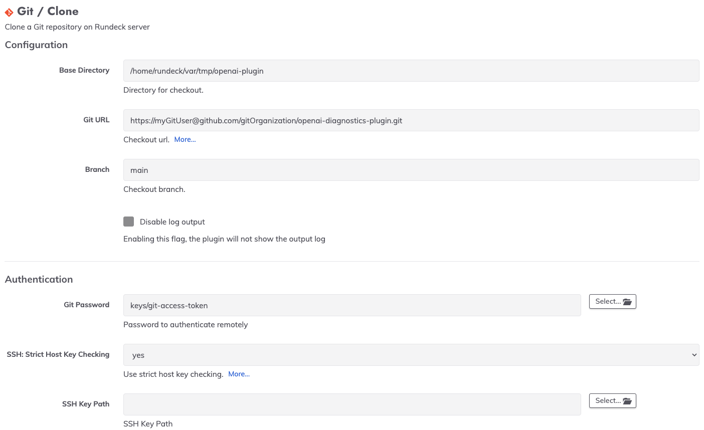

# Git Plugin

This is a git plugin (based on [Jgit](https://www.eclipse.org/jgit/)) which contain a Resource model and worflow steps

For authentication, it can be used a private key or a password.
If the private key is not defined, then the password will be used. 

* The primary key will work with SSH protocol on the Git URL. 
* The password will work with http/https protocol on the Git URL (the most of the case, the username is needed on the URI, eg: `http[s]://username@host.xz[:port]/path/to/repo.git/`  when you use password authentication)


## Build

Run the following command to built the jar file:

```
./gradlew clean build
```

## Install

Copy the `git-plugin-x.y.x.jar` file to the `$RDECK_BASE/libext/` directory inside your Rundeck installation.


## GIT Resource Model

This is a resource model plugin that uses Git to store resources model file.

### Configuration

You need to set up the following options to use the plugin:


### Repo Settings

* **Base Directory**: Directory for checkout
* **Git URL**: Checkout URL.
    See [git-clone](https://www.kernel.org/pub/software/scm/git/docs/git-clone.html)
    specifically the [GIT URLS](https://www.kernel.org/pub/software/scm/git/docs/git-clone.html#URLS) section.
    Some examples:
    * `ssh://[user@]host.xz[:port]/path/to/repo.git/`
    * `git://host.xz[:port]/path/to/repo.git/`
    * `http[s]://host.xz[:port]/path/to/repo.git/`
    * `ftp[s]://host.xz[:port]/path/to/repo.git/`
    * `rsync://host.xz/path/to/repo.git/`

* **Branch**: Checkout branch
* **Resource model File**: Resource model file inside the github repo. This is the file that will be added to Rundeck resource model.
* **File Format**:  File format of the resource model, it could be xml, yaml, json
* **Writable**: Allow to write the remote file

### Authentication

* **Git Password**: Password to authenticate remotely
* **SSH: Strict Host Key Checking**: Use strict host key checking.
If `yes`, require remote host SSH key is defined in the `~/.ssh/known_hosts` file, otherwise do not verify.
* **SSH Key Path**: SSH Key Path to authenticate

### Limitations

* The plugin needs to clone the full repo on the local directory path (Base Directory option) to get the file that will be added to the resource model.
* Any time that you edit the nodes on the GUI, the commit will be perfomed with the message `Edit node from GUI`  (it is not editable)

## GIT Clone Workflow Step

This plugin clone a git repo into a rundeck server folder.

For some use cases, it might be necessary to only allow checking out repositories in directories relative to the Rundeck home directory.
Allow users to checkout in any location on disk might be a security issue.

The setting `project.plugin.WorkflowStep.git-clone-step.gitUseProjectBasedSubdirectory` (per project) or  `framework.plugin.WorkflowStep.git-clone-step.gitUseProjectBasedSubdirectory` (Rundeck-wide)
can be set to `true` to enforce this (default is `false`). All values of `Base Directory` will be relative to a project-based subdirectory of the Rundeck home directory (e.g. `/var/lib/rundeck/A_Project`).

### Configuration

You need to set up the following options to use the plugin:



### Repo Settings

* **Base Directory**: Directory for checkout. If `project.plugin.WorkflowStep.git-clone-step.gitUseProjectBasedSubdirectory` is set to true in the project configuration, this will be relative to a project-based subdirectory.
* **Git URL**: Checkout URL.
    See [git-clone](https://www.kernel.org/pub/software/scm/git/docs/git-clone.html)
    specifically the [GIT URLS](https://www.kernel.org/pub/software/scm/git/docs/git-clone.html#URLS) section.
    Some examples:
    * `ssh://[user@]host.xz[:port]/path/to/repo.git/`
    * `git://host.xz[:port]/path/to/repo.git/`
    * `http[s]://host.xz[:port]/path/to/repo.git/`
    * `ftp[s]://host.xz[:port]/path/to/repo.git/`
    * `rsync://host.xz/path/to/repo.git/`

* **Branch**: Checkout branch

### Authentication

* **Password Storage Path**: Password storage path to authenticate remotely
* **SSH: Strict Host Key Checking**: Use strict host key checking.
If `yes`, require remote host SSH key is defined in the `~/.ssh/known_hosts` file, otherwise do not verify.
* **SSH Key Storage Path**: SSH Key storage path to authenticate

